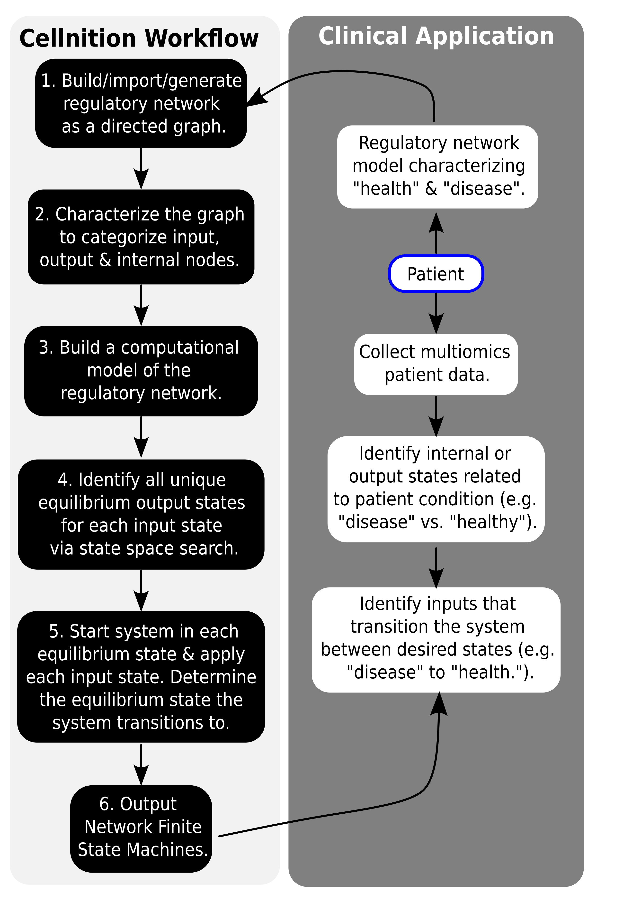

# Basic Usage

The Jupyter Notebook [Tutorials](https://github.com/betsee/cellnition#tutorials) are a great 
place to get started with *Cellnition*. 

The general workflow to create NFSMs in *Cellnition* comprises 6 main steps:

1. Build, import, or procedurally generate a regulatory network as a directed graph.
2. Characterize the graph to automatically categorize input, output & internal nodes.
3. Build a computational model of the regulatory network.
4. Identify all unique equilibrium output states for each input state via state space search.
5. Create the NFSMs. Cellnition does this by starting the system in each equilibrium state, 
applying each input state, and determining the equilibrium state that the system transitions to.
6. Output, plot, and analyze the resulting Network Finite State Machines. 

[Link References]::
[Levin Lab]: https://as.tufts.edu/biology/levin-lab
[CPython]: https://github.com/python/cpython
[Codecov]: https://about.codecov.io
[pytest]: https://docs.pytest.org
[tox]: https://tox.readthedocs.io
[Python]: https://www.python.org
[Github Actions]: https://github.com/features/actions
[Tufts University]: https://www.tufts.edu
[APACHE license]: https://www.apache.org/licenses/LICENSE-2.0
[license]: https://github.com/betsee/cellnition/blob/main/LICENSE
[Tutorial 1]: https://github.com/betsee/cellnition/blob/main/ipynb/Tutorial1_ContinuousNFSM_v1.ipynb
[Tutorial 2]: https://github.com/betsee/cellnition/blob/main/ipynb/Tutorial2_BooleanNFSM_v1.ipynb